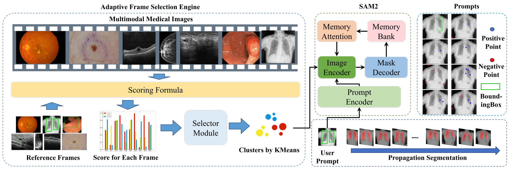
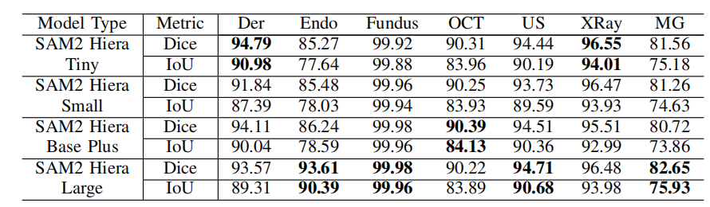
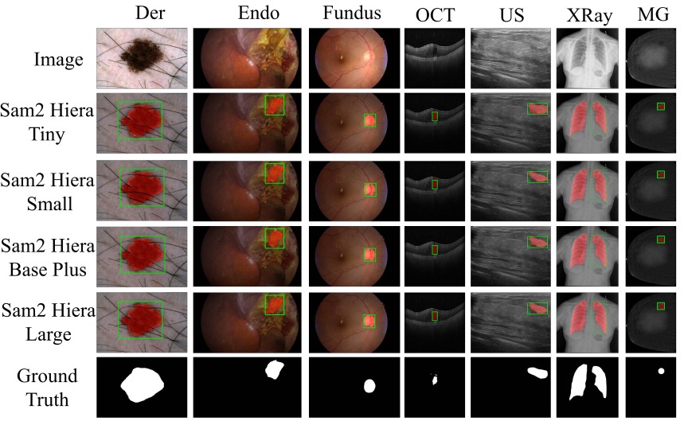

<p align="center">
    
<p>
<h3 align="center"><a href="">
Adaptive Interactive Segmentation for Multimodal
Medical Imaging via Selection Engine</a></h3>
<h5 align="center"> If our project helps you, please give us a star ⭐ on GitHub to support us. 🙏🙏 </h2>

  

<div align="center"></div>

## 📰 News
* **[2024.11.26]**  Release pretrained checkpoints of SISeg. 
* **[2024.11.21]**  Release evaluation codes of SISeg. And the evaluation logs for every singal datasets.

## 🛠️ Requirements and Installation

Basic Dependencies:
* Python >= 3.8
* Pytorch >= 2.1.0
* CUDA Version >= 11.8

[Local] Install CL:

```bash
pip install -e .
```

Install required packages:
```bash
git clone https://github.com/RicoLeehdu/SISeg.git
cd SISeg
pip install -r requirements.txt
```


## 🔑 Usage

A simple example about how to adopt cluster. Using such command for attempting:
```
python eval_score.py
```

```python
import os
import cv2
import numpy as np
from sklearn.cluster import KMeans
import shutil
import logging

# Set up logging
logging.basicConfig(filename='cluster_score.log', level=logging.INFO, format='%(asctime)s - %(levelname)s - %(message)s')

# Composite scoring function for brightness, contrast, edge density, color histogram similarity, shape similarity, etc.
def calculate_brightness_score(image):
    gray = cv2.cvtColor(image, cv2.COLOR_BGR2GRAY)
    mean_brightness = np.mean(gray)
    return mean_brightness / 255.0

def calculate_contrast_score(image):
    gray = cv2.cvtColor(image, cv2.COLOR_BGR2GRAY)
    contrast = np.std(gray)
    return contrast / 255.0

def calculate_edge_density(image):
    gray = cv2.cvtColor(image, cv2.COLOR_BGR2GRAY)
    edges = cv2.Canny(gray, 100, 200)
    return np.mean(edges)

def calculate_color_histogram_similarity(ref_image, image):
    ref_hsv = cv2.cvtColor(ref_image, cv2.COLOR_BGR2HSV)
    hsv = cv2.cvtColor(image, cv2.COLOR_BGR2HSV)
    hist_ref = cv2.calcHist([ref_hsv], [0, 1], None, [50, 60], [0, 180, 0, 256])
    hist = cv2.calcHist([hsv], [0, 1], None, [50, 60], [0, 180, 0, 256])
    hist_ref = cv2.normalize(hist_ref, hist_ref).flatten()
    hist = cv2.normalize(hist, hist).flatten()
    score = cv2.compareHist(hist_ref, hist, cv2.HISTCMP_CORREL)
    return score

def calculate_shape_similarity(ref_image, image):
    ref_gray = cv2.cvtColor(ref_image, cv2.COLOR_BGR2GRAY)
    gray = cv2.cvtColor(image, cv2.COLOR_BGR2GRAY)
    ref_moments = cv2.moments(ref_gray)
    moments = cv2.moments(gray)
    hu_moments_ref = cv2.HuMoments(ref_moments).flatten()
    hu_moments = cv2.HuMoments(moments).flatten()
    # Avoid log(0)
    epsilon = 1e-10
    score = -np.log(np.sum(np.abs(hu_moments_ref - hu_moments)) + epsilon)
    return score

def compute_composite_score(ref_image, image):
    brightness_weight = 0.1
    contrast_weight = 0.1
    edge_density_weight = 0.1
    color_histogram_weight = 0.3
    shape_similarity_weight = 0.4
    brightness_score = calculate_brightness_score(image)
    contrast_score = calculate_contrast_score(image)
    edge_density_score = calculate_edge_density(image)
    color_histogram_score = calculate_color_histogram_similarity(ref_image, image)
    shape_similarity_score = calculate_shape_similarity(ref_image, image)
    composite_score = (
        brightness_weight * brightness_score +
        contrast_weight * contrast_score +
        edge_density_weight * edge_density_score +
        color_histogram_weight * color_histogram_score +
        shape_similarity_weight * shape_similarity_score
    )
    return composite_score

def resize_frame(frame, target_size):
    """Resize the frame"""
    return cv2.resize(frame, target_size, interpolation=cv2.INTER_LINEAR)

def select_representative_frames_by_kmeans(frames, ref_frame_idx, num_clusters=5):
    """Select representative frames based on KMeans clustering and reference frame"""
    ref_frame = frames[ref_frame_idx]
    target_size = (ref_frame.shape[1], ref_frame.shape[0])  # Width, Height
    resized_frames = [resize_frame(frame, target_size) for frame in frames]
    # Compute composite scores between reference frame and all other frames
    composite_scores = []
    for i, frame in enumerate(resized_frames):
        if i == ref_frame_idx:  # Skip comparison with the reference frame itself
            continue
        score = compute_composite_score(ref_frame, frame)
        composite_scores.append(score)
        logging.info(f"Composite score between reference frame and frame {i+1}: {score:.4f}")
    composite_scores = np.array(composite_scores).reshape(-1, 1)
    # Perform KMeans clustering
    logging.info("Performing KMeans clustering...")
    kmeans = KMeans(n_clusters=num_clusters, random_state=42)
    kmeans.fit(composite_scores)
    # Find the frame closest to each cluster center
    selected_indices = []
    for center in kmeans.cluster_centers_:
        closest_idx = np.argmin(np.abs(composite_scores - center))
        if closest_idx not in selected_indices:  # Prevent selecting the same frame multiple times
            selected_indices.append(closest_idx)
        logging.info(f"Selected frame {closest_idx+1} as a cluster center.")
    # Ensure cluster centers do not include clusters with only the reference frame
    if ref_frame_idx in selected_indices:
        selected_indices.remove(ref_frame_idx)
    return sorted(set(selected_indices)), kmeans.labels_

def sort_frames_within_clusters(frames, ref_frame, labels, num_clusters):
    """Sort frames within clusters based on composite scores"""
    target_size = (ref_frame.shape[1], ref_frame.shape[0])  # Ensure the same size as the reference frame
    resized_frames = [resize_frame(frame, target_size) for frame in frames]
    sorted_clusters = []
    for cluster in range(num_clusters):
        cluster_indices = np.where(labels == cluster)[0]
        cluster_frames = [resized_frames[idx] for idx in cluster_indices]
        # Sort frames within the cluster based on the reference frame
        composite_scores = [compute_composite_score(ref_frame, frame) for frame in cluster_frames]
        sorted_cluster_indices = [x for _, x in sorted(zip(composite_scores, cluster_indices), reverse=True)]
        sorted_clusters.append(sorted_cluster_indices)
        logging.info(f"Sorted frames in cluster {cluster}: {[i+1 for i in sorted_cluster_indices]}")
    return sorted_clusters

def save_cluster_sorting_info(sorted_clusters, dataset_name, output_folder):
    """Save sorted frame indices after clustering"""
    for cluster_idx, cluster_frames in enumerate(sorted_clusters):
        output_file = os.path.join(output_folder, f"{dataset_name}_cluster_{cluster_idx}_sorted.txt")
        with open(output_file, 'w') as f:
            for frame_idx in cluster_frames:
                f.write(f"{dataset_name} Frame {frame_idx+1:06d}\n")
        logging.info(f"Saved sorted frames for cluster {cluster_idx} in {output_file}")

def copy_frames_to_cluster_folders(frames, sorted_clusters, dataset_folder, output_folder):
    """Copy sorted cluster results to corresponding folders"""
    if not os.path.exists(output_folder):
        os.makedirs(output_folder)
    for cluster_idx, cluster_frames in enumerate(sorted_clusters):
        cluster_folder = os.path.join(output_folder, f"cluster_{cluster_idx}")
        os.makedirs(cluster_folder, exist_ok=True)
        for frame_idx in cluster_frames:
            src_image_path = os.path.join(dataset_folder, f"{frame_idx+1:06d}.jpg")
            dst_image_path = os.path.join(cluster_folder, f"{frame_idx+1:06d}.jpg")
            shutil.copy(src_image_path, dst_image_path)
        # Mark the cluster center
        cluster_center = cluster_frames[0]
        with open(os.path.join(cluster_folder, "cluster_center.txt"), "w") as f:
            f.write(f"Cluster center frame: {cluster_center+1:06d}.jpg")
        logging.info(f"Cluster {cluster_idx} center is frame {cluster_center+1}.")

def process_datasets_for_clustering(npz_dataset_folders, jpg_output_folder, clustered_output_folder, ref_frame_idx=0, num_clusters=5):
    """Process all datasets for clustering"""
    for dataset_folder in npz_dataset_folders:
        dataset_name = os.path.basename(dataset_folder)
        image_folder = os.path.join(jpg_output_folder, dataset_name)
        output_folder = os.path.join(clustered_output_folder, dataset_name)
        # Read image sequences and filter out images that cannot be loaded
        num_images = len(os.listdir(image_folder))
        frames = []
        for i in range(num_images):
            image_path = os.path.join(image_folder, f"{i+1:06d}.jpg")
            frame = cv2.imread(image_path)
            if frame is not None:
                frames.append(frame)
            else:
                logging.warning(f"Failed to load image: {image_path}")
        if not frames:
            logging.warning(f"No valid images found in {image_folder}. Skipping dataset.")
            continue
        # Select representative frames
        selected_indices, labels = select_representative_frames_by_kmeans(frames, ref_frame_idx, num_clusters)
        # Sort frames within each cluster
        ref_frame = frames[ref_frame_idx]
        sorted_clusters = sort_frames_within_clusters(frames, ref_frame, labels, num_clusters)
        # Copy frames to corresponding folders
        copy_frames_to_cluster_folders(frames, sorted_clusters,

                                       
                                       

# Example usage
npz_dataset_folders = [
''
]
jpg_output_folder = ""
clustered_output_folder = ""

process_datasets_for_clustering(npz_dataset_folders, jpg_output_folder, clustered_output_folder, ref_frame_idx=0, num_clusters=5)

                                       
```

## 🚀 Main Results

### Zero-Shot Performance
<p></p>

### Visualization Results
<p></p>


## 🗝️ Evaluation

### Quick Start

To facilitate further development on top of our codebase, we provide a quick-start guide on how to use SISeg.

 Data Structure:

```bash
SISeg
├── datasets
│   ├── val_jpg/
|   |   ├── Dermoscopy_ISIC2018_Part1/
|	|	|	|── cluster01/
|   |   ├── Dermoscopy_ISIC2018_Part2
|   |   ├── Endoscopy_CholecSeg8k/
|   |   └── ...
│   ├── clustered_output_score/ 
|   |   ├── Dermoscopy_ISIC2018_Part1/
|   |   ├── Dermoscopy_ISIC2018_Part2
|   |   ├── Endoscopy_CholecSeg8k/
|   |   └── ...
```

## 📘 Checkpoints and evaluation logs
- checkpoints: https://drive.google.com/drive/folders/1ZIlfrpkOFb8O2Hd4YhUg7sHQ79tjogNg?usp=sharing
- evaluation logs: https://drive.google.com/drive/folders/1aKigZXlRCxue7DO3iHK2HQJ1gXSbSBEB?usp=sharing


## 📑 Citation

If you find Inf-CLIP useful for your research and applications, please cite using this BibTeX:
```bibtex
@article{damovl2024infcl,
  title={Breaking the Memory Barrier: Near Infinite Batch Size Scaling for Contrastive Loss},
  author={Zesen Cheng, Hang Zhang, Kehan Li, Sicong Leng, Zhiqiang Hu, Fei Wu, Deli Zhao, Xin Li, Lidong Bing},
  journal={arXiv preprint arXiv:2410.17243},
  year={2024},
  url={https://arxiv.org/abs/2410.12787}
}
```


## 👍 Acknowledgement

The codebase of SISeg is adapted from MedSAM and S. We are also grateful for the following projects our SISeg arose from:

- [**MedSAM**](https://github.com/bowang-lab/MedSAM), [**SAM2**](https://github.com/facebookresearch/sam2/tree/main)

## 🔒 License

This project is released under the Apache 2.0 license as found in the LICENSE file.